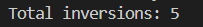

# Array Inversion Counter

This Python program counts the total number of inversions in an array using a modified **Merge Sort** algorithm. An inversion is defined as a pair of indices \(i\) and \(j\) such that \(i < j\) and `arr[i] > arr[j]`.

## How It Works

- The algorithm recursively splits the array into two halves.
- During the merge step, it counts inversions when an element from the right subarray is placed before an element from the left subarray.
- The time complexity is **O(n log n)**, making it efficient for large arrays.

## Example

For the array `[1, 20, 6, 4, 5]`, the program outputs:

Total inversions: 5

This indicates that there are 5 pairs where `arr[i] > arr[j]` and `i < j`.

